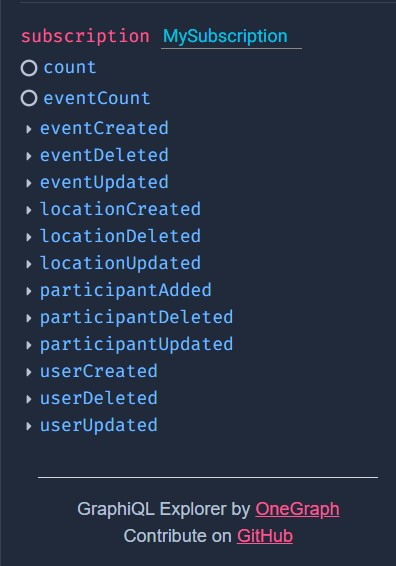
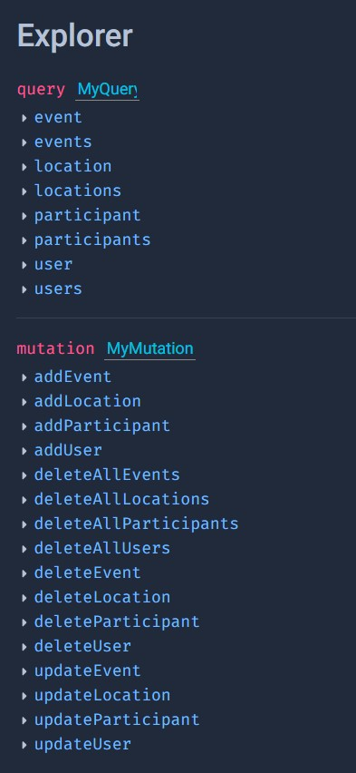

# GRAPHQL-SUBSCRIPTION EXAMPLE

### Yeni bir User, Event veya bir Event'e Participant eklendiğinde bu veri Subscription üzerinden iletilmektedir.

### Günün sonunda aşağıdaki Mutationlar, Queryler ve Subscriptionlar çalışıyor olacaktır.

